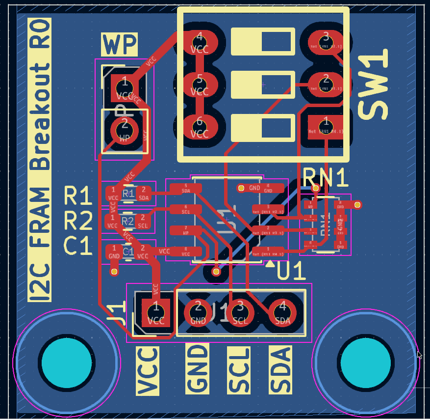
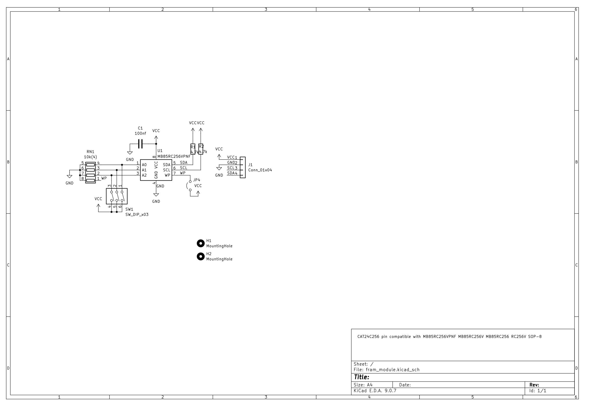
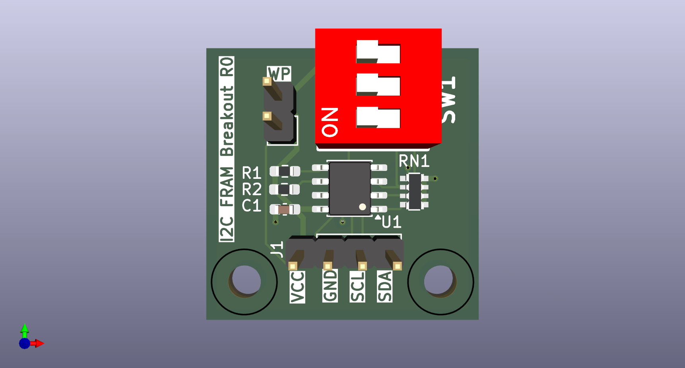

# FRAM I2C BREAKOUT MODULE

## Introduction

## Schematic

## Features

## Part List

|     | Part #        | REF#                   | Package            |
| --- | ------------- | ---------------------- | ------------------ |
|2x|4.7k R|R1 R2|0603
|1x|100n C|C1|0603
|1x|10k R (4)|RN1|0603
|1x|MB85RC256VPNF|U1|SOP-8
| 1x  | 1x04          | J1                     | 2.54mm pins DIP    |
| 1x  | 1x02          | JP4                     | 2.54mm pins DIP    |
| 1x  | 1x03          | SW1                     | 2.54mm DIP Switch    |
